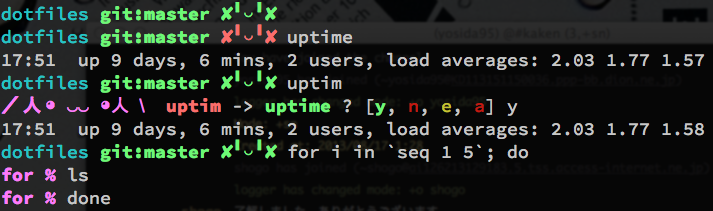

# dotfiles

## About
yosida95 が実際に使用している dotfiles です。

Makefile を同梱しているので make コマンド一発で設定ができます。

## LICENSE
This repository is licensed under the [MIT LICENSE]( http://yosida95.mit-license.org/).

## Mac OS X にまつわる色々
### path_helper
Mac OS X デフォルトの PATH 設定は path_helper(8) によって行なわれています。 path_helper(8) は /etc/zshenv から呼び出されています。
この path_helper(8) の詳しい動きは man を参考にしてもらうとして、ざっくり言うと既存の PATH に OS X デフォルトの PATH をより高い優先度で追加するという動きをします。

一方で、 yosida95 固有の PATH の設定は ~/.zprofile で行っています。 ~/.zprofile も path_helper(8) と同様に既存の PATH に対してより高い優先度でパスを追加しています。
~/.zshenv で行っていないのはシェルスクリプトを実行または作成するときに yosida95 固有の設定によって動作が変わってしまう事を嫌って、 ~/.zshrc で行っていないのは PATH の設定は基本的に頻繁に変えるものではなく、ログイン時に 1 度だけ行なわれれば十分であると考えているからです。

ここで、インタラクティブシェルを起動、またはシェルスクリプトを実行するときの動きを考えてみます。
前提知識として、 ZSH の設定ファイルのロード順を説明すると以下のとおりになります。
#### ログインシェルとして起動したとき
1. /etc/zshenv, $HOME/.zshenv
+ /etc/zprofile, $HOME/.zprofile
+ /etc/zshrc, $HOME/.zshrc
+ /etc/zlogin, $HOME/.zlogin

#### インタラクティブシェルとして起動したとき
1. /etc/zshenv, $HOME/.zshenv
+ /etc/zshrc, $HOME/.zshrc

#### シェルスクリプトを実行したとき
1. /etc/zshenv, $HOME/.zshenv

ログイン時には上記の「ログインシェルとして起動したとき」の順序に従って、まず /etc/zshenv が適用されることで /usr/libexec/path_helper が PATH を設定した上で、 .zprofile が yosida95 固有の PATH を設定します。

この状態でインタラクティブシェルを起動またはシェルスクリプトを実行すると、 /etc/zshenv が適用されて /usr/libexec/path_helper の 2 度目の実行が行なわれます。
yosida95 固有の PATH の設定は $HOME/.zprofile で行っているため、この時には設定されません。

```sh
# ログインシェルとして起動
# 初期状態
PATH=/usr/bin:/bin:/usr/sbin:/sbin
# /etc/zshenv が適用
PATH=/usr/local/bin:/usr/bin:/bin:/usr/sbin:/sbin  # /usr/local/bin が追加された
# $HOME/.zprofile が適用
PATH=/opt/python/2.7/bin:/usr/local/bin:/usr/bin:/bin:/usr/sbin:/sbin  # /opt/python/2.7/bin が追加された

# インタラクティブとして起動
# /etc/zshenv が適用
PATH=/usr/local/bin:/opt/python/2.7/bin:/usr/local/bin:/usr/bin:/bin:/usr/sbin:/sbin  # /usr/local/bin が追加された
```

このようにインタラクティブとして起動すると、 PATH に重複が生じる上、 /opt/python/2.7/bin よりも /usr/local/bin の方が優先度が高くなってしまうため、意図したコマンドが起動されない場合が生じます。

この解決策として私は /etc/zshenv に手を加えるという方法を取っています。具体的には、 /etc/zshenv が path_helper(8) を呼ぶ条件を PATH が /usr/bin:/bin:/usr/sbin:/sbin の時のみに限定しています。

### reattach-to-usernamespace
Mac OS X では tmux を介した時に pbcopy や pbpaste がうまく働かなくなるという問題があります。
詳しくは [ChrisJohnsen/tmux-MacOSX-pasteboard](https://github.com/ChrisJohnsen/tmux-MacOSX-pasteboard) をご覧ください。

この解決策として、 tmux を Mac OS X で実行した時には、 reattach-to-user-namespace を介した上で ZSH を立ちあげ、 pbcopy や pbpaste も reattach-to-usernamespace を介して実行しています。

詳しくは .tmux.conf をご覧ください。

##注意
.hgrc と.gitconfigにぼくのusername が設定されているので、そのままにすると君のコミットはすべてぼくのものになってしまうよ

## Screenshots
### Zsh

