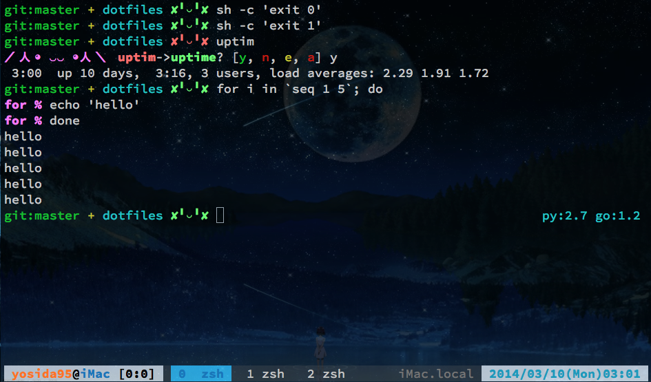

# dotfiles

## About
yosida95 が実際に使用している dotfiles です。

Makefile を同梱しているので make コマンド一発で設定ができます。

## LICENSE
This repository is licensed under the [MIT LICENSE]( http://yosida95.mit-license.org/).

## Mac OS X にまつわる色々
### reattach-to-usernamespace
Mac OS X では tmux を介した時に pbcopy や pbpaste がうまく働かなくなるという問題があります。
詳しくは [ChrisJohnsen/tmux-MacOSX-pasteboard](https://github.com/ChrisJohnsen/tmux-MacOSX-pasteboard) をご覧ください。

この解決策として、 tmux を Mac OS X で実行した時には、 reattach-to-user-namespace を介した上で ZSH を立ちあげ、 pbcopy や pbpaste も reattach-to-usernamespace を介して実行しています。

詳しくは .tmux.conf をご覧ください。

##注意
.hgrc と.gitconfigにぼくのusername が設定されているので、そのままにすると君のコミットはすべてぼくのものになってしまうよ

## Screenshots
### Zsh

